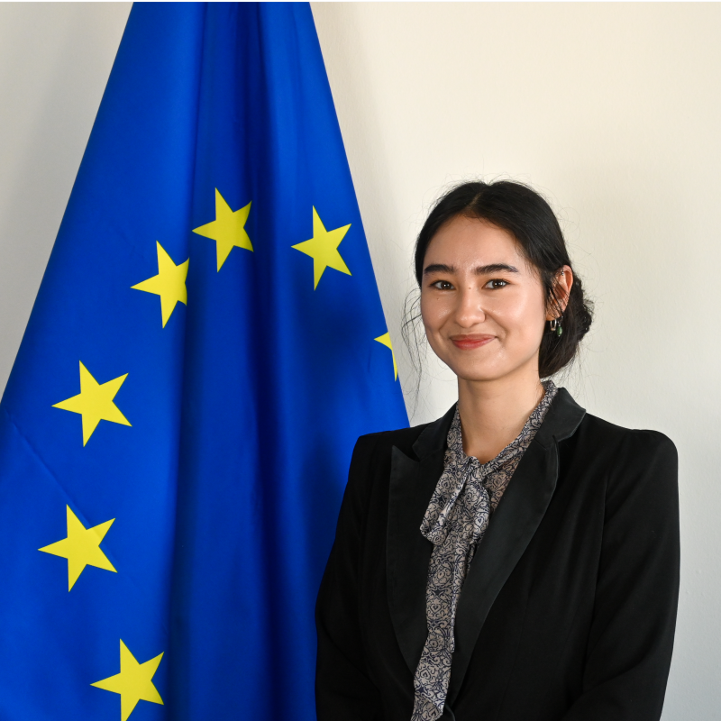

## About Me

Hi, I'm Irina! I'm a researcher and (almost) lawyer working at the intersection of human rights, EU policy, and anti-trafficking work. Currently based in Brussels, where I'm doing a Bluebook Traineeship at the **European Commission** after spending the last year as a Researcher at **La Strada International**.

My academic path has been a bit of a winding one — I studied European Studies (with a heavy dose of EU law), then a Master's in Public International Law focused on migration, and somewhere along the way I also picked up a Bachelor's in Psychology because understanding *why* people do what they do felt just as important as understanding the rules they're supposed to follow. All three at the **University of Amsterdam**.

I care a lot about evidence-based policy, doing research that actually reaches the people it's meant to help, and the small but stubborn details that make EU institutions tick.

## Experience







## Education







## Selected Writing

A couple of the longer reports I've worked on:

* [2024 Trafficking in Human Beings Assistance Statistics and Trends](assets/documents/lsi-data-report-2024.pdf)
* [Assisting Displaced Persons from Ukraine: Indications of Human Trafficking and Labour Exploitation](assets/documents/lsi-ukraine-case-assessment.pdf)
* [2023 Trafficking in Human Beings Assistance Statistics and Trends](assets/documents/3579-2023 - Statistics and Trends La Strada International.pdf)
* [Non-punishment Report](assets/documents/3636-LSI_Non Punishment Report2025.pdf)

## Languages

| Language | Level |
|----------|-------|
| 🇷🇴 Romanian | Native |
| 🇬🇧 English  | Advanced |
| 🇮🇹 Italian  | Intermediate |
| 🇨🇳 Mandarin | Intermediate |
| 🇫🇷 French   | Basic |

## Get in touch

The easiest way to reach me is via the [contact page](contact). Always happy to chat about anti-trafficking research, EU policy, migration law in one of the five languages above (results may vary for Italian, Mandarin, and French).
